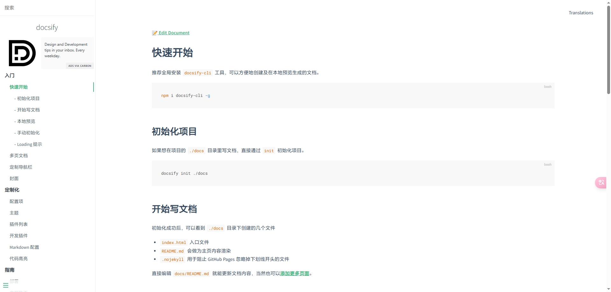
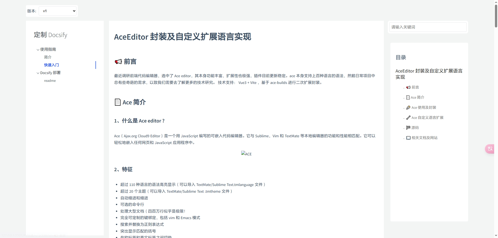

# 🌟 定制化 Docsify 文档框架实战分享

在构建前端文档平台时，我们希望拥有更友好的用户界面、便捷的搜索、清晰的目录导航以及实用的代码复制功能。借助 [Docsify](https://docsify.js.org/)，我实现了以下几个方面的定制优化，分享给大家 🙌。

> 📌 本文基于 Docsify + 插件实现，包括自定义 JavaScript 功能注入与样式优化。

## 🎨 UI 界面改造

仿 CSDN 布局模式及 UI，去除左侧菜单收展，左侧菜单只展示文档目录，右侧增加搜索及文档内容目录，整体看上去更简洁点，当然你可以随意改你喜欢的样式；

**原始 UI**


**改造后 UI**


## 🎫 版本控制

通过动态更改文档资源根路径实现文档版本切换；

**配置：**

```javascript
 basePath: sessionStorage.getItem("version") || "/docs/v1",
```

**HTML 实现：**

```html
<div class="versionBox">
  <label for="version">版本:</label>
  <select id="version" name="version" onchange="changeBasePath(this)">
    <option value="a">v1</option>
    <option value="b">v2</option>
  </select>
</div>
```

**JS ：**

```javascript
function changeBasePath(select) {
  var selectedValue = select.value;
  if (selectedValue === "a") {
    sessionStorage.setItem("version", "/docs/v1");
    sessionStorage.setItem("ver", "a");
  } else if (selectedValue === "b") {
    sessionStorage.setItem("version", "/docs/v2");
    sessionStorage.setItem("ver", "b");
  }

  window.location.reload();
}
```

## 🔍 搜索功能配置

通过引入 search.min.js 插件，并配置如下，实现了全文搜索功能，支持关键词高亮匹配与模糊查询。

**配置代码：**

```javascript
search: {
  maxAge: 86400000, // 一天缓存
  paths: "auto",
  placeholder: "请输入关键词",
  noData: "未检索到相关内容!",
  depth: 2,
  hideOtherSidebarContent: false
}

```

## 📚 自定义浮动目录（锚点导航）

Docsify 默认只提供左侧文档目录，现需要实现一个右侧的文档内容导航目录，通过自定义插件读取文档内容生成目录。

实现逻辑包括：

- 获取 .content 中所有 h1 ~ h3

- 动态生成目录列表并缩进

- 自动隐藏无标题页面目录

- 修复锚点跳转偏移问题（插入空的 <div>）

**核心插件代码：**

```javascript
hook.doneEach(function () {
  var floatingToc = document.querySelector(".floating-toc");
  if (!floatingToc) {
    floatingToc = document.createElement("div");
    floatingToc.className = "floating-toc";
    document.body.appendChild(floatingToc);
    var tocHeader = document.createElement("h2");
    tocHeader.textContent = "目录";
    floatingToc.appendChild(tocHeader);
  }

  floatingToc.innerHTML = "<h2>目录</h2>";
  var currentUrl = window.location.href.split("?")[0];
  var content = document.querySelector(".content");

  if (content) {
    var headers = content.querySelectorAll("h1, h2, h3");
    if (headers.length > 1) {
      floatingToc.style.display = "block";
      var tocList = document.createElement("ul");
      floatingToc.appendChild(tocList);
      headers.forEach(function (header) {
        var li = document.createElement("li");
        var level = parseInt(header.tagName.substring(1)) - 1;
        li.style.marginLeft = level * 20 + "px";

        var anchorLink = document.createElement("a");
        anchorLink.href = currentUrl + "#" + header.id;
        anchorLink.textContent = header.textContent;
        li.appendChild(anchorLink);
        tocList.appendChild(li);
      });
    } else {
      floatingToc.style.display = "none";
    }

    var anchors = document.querySelectorAll("h2[id],h3[id],h4[id]");
    anchors.forEach(function (anchor) {
      var fixAnchorDiv = document.createElement("div");
      fixAnchorDiv.className = "fix-anchor";
      fixAnchorDiv.id = anchor.id;
      anchor.parentNode.insertBefore(fixAnchorDiv, anchor);
      anchor.id = "";
    });
  } else {
    floatingToc.style.display = "none";
  }
});
```

## 📋 代码复制功能

我们使用了 docsify-copy-code 插件，给所有代码块添加“点击复制”按钮。

**引入插件：**

```javascript
<script src="//cdn.jsdelivr.net/npm/docsify-copy-code/dist/docsify-copy-code.min.js"></script>
```

**配置：**

```
copyCode: {
buttonText: "点击复制",
errorText: "Error",
successText: "复制成功"
}
```

## ✅ 总结

通过简单的 HTML + JS + 插件组合，我们在原始 Docsify 的基础上实现了以下功能：

- 多版本切换支持

- 搜索功能优化

- 浮动目录导航

- 一键复制代码

- UI 更加美观清晰

### 🧑‍💻 后续计划

- 🌐 支持多语言国际化（i18n）

- 🌗 主题切换（深色 / 浅色模式）

- 🚀 与 GitHub Actions 等 CI/CD 集成自动部署

## 源码地址

https://github.com/Bing-b/docs
